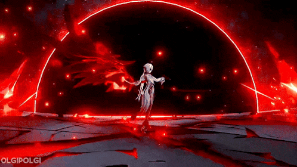
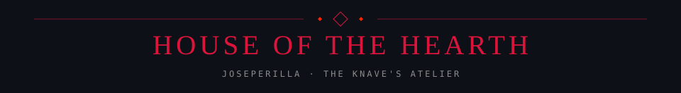

  
   
  
  
  
<samp>ASHES TO ARCHITECTURE &nbsp; ◈ &nbsp; CODE IN CRIMSON</samp>

  

    
    
  

  <h2>♜ &nbsp; Fatui Arsenal</h2>
  
<samp>THE TOOLS BEHIND THE FLAME</samp>

  <table align="center" border="0" cellspacing="0" cellpadding="12" role="presentation">
    <tr>
      <td align="center"></td>
      <td align="center"></td>
      <td align="center"></td>
    </tr>
    <tr>
      <td align="center"></td>
      <td align="center"></td>
      <td align="center"></td>
    </tr>
  </table>

  <h2>◈ &nbsp; The Knave's Records</h2>
  
<samp>EVERY COMMIT LEAVES AN EMBER</samp>

  <!-- Prefer cards generated daily by GitHub Readme Stats Action. The public API is a fallback. -->
  <table align="center" width="100%" border="0" cellspacing="0" cellpadding="0" role="presentation">
    <tr>
      <td width="50%" align="center" valign="top">
        <a href="https://github.com/JosePerilla?tab=overview">
          <picture>
            <source srcset="https://raw.githubusercontent.com/JosePerilla/JosePerilla/output/github-stats.svg" type="image/svg+xml" />
            
          </picture>
        </a>
      </td>
      <td width="50%" align="center" valign="top">
        <a href="https://github.com/JosePerilla?tab=repositories">
          <picture>
            <source srcset="https://raw.githubusercontent.com/JosePerilla/JosePerilla/output/top-languages.svg" type="image/svg+xml" />
            
          </picture>
        </a>
      </td>
    </tr>
  </table>

  <h2>✦ &nbsp; The Eternal Hearth</h2>
  
<samp>A CRIMSON TRAIL THROUGH THE ASHES</samp>

  <picture>
    <source media="(prefers-color-scheme: dark)" srcset="https://raw.githubusercontent.com/JosePerilla/JosePerilla/output/github-contribution-grid-snake-dark.svg" />
    
  </picture>
  
Arlecchino · La Sota · House of the Hearth

  
<a href=".assets/SOURCES.md">Visual credits</a> &nbsp; · &nbsp; <a href=".github/PROFILE.md">About the living hearth</a>

